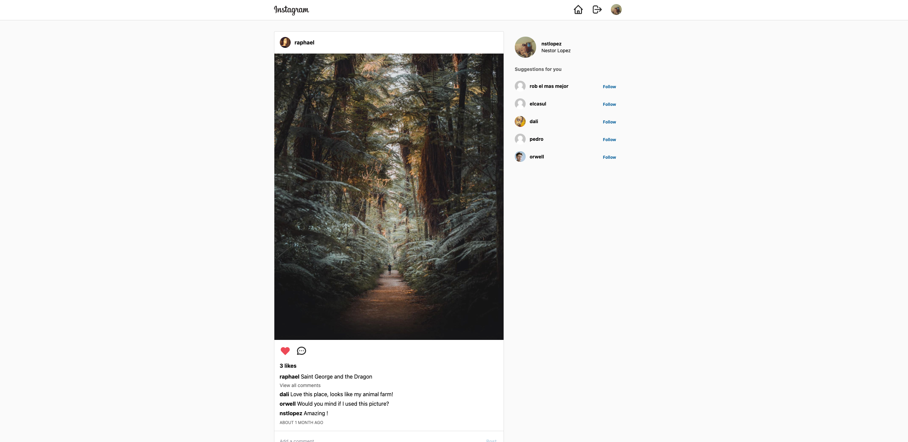

<p align="center">
  <a href="https://photos.nstlopez.com">
    
  </a>
</p>
<h1 align="center">Instagram Clone</h1>
<p align="center">An Instagram clone made entirely on React.</p>
<p align="center"><a href="https://photos.nstlopez.com">Check it out here!</a></p>
<br />
<br>
<p align="center">
  <a href="https://photos.nstlopez.com">
    
  </a>
</p>
<br>
 
#### Summary
> **Default Credentials** **Mail**: test@mail.com **Password**: test1234

This app, built in **React** (CRA) is a clone of Facebooks [Instagram](https://www.instagram.com). Having a Login, Sign Up, Dashboard and Profile page, some private with Auth-listeners.

For data I used **Firebase** firestore all retrieved using a custom hook.

For styling **TailwindCSS** is being used. I really enjoyed working with it thanks to the ease of use it features.

Finally, it uses **Jest** and **react-testting-library** for tests and also features **Cypress** for E2E testing.

You can read more about its development on my [portfolio article](https://nstlopez.com/project/instagram-clone).

## Getting Started

Follow the steps below:

### ⏳ Installation

Install all required dependencies with this command:

- You can use `npm` if you like, but I highly recomend you stick with `yarn`.

```bash
yarn install
```

After all dependencies are installed you will require to fill a few enviromental variables to make the page work perfectly with your own Firebase data.

Create a `.env` file inside the `/` folder having the following structure.

```env
  REACT_APP_apiKey=
  REACT_APP_authDomain=
  REACT_APP_projectId=
  REACT_APP_storageBucket=
  REACT_APP_messagingSenderId=
  REACT_APP_appId=
```

After you have done this, you can launch the app with `yarn start` or with any of the scripts inside of `package.json`.

## License

See the [LICENSE](./LICENSE) file for licensing information.
